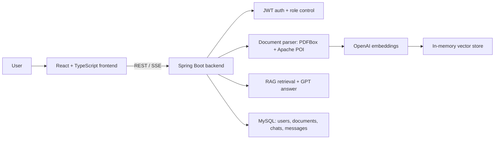

# Housing Rental AI Assistant

A RAG-based rental document assistant supporting PDF parsing, source-grounded answers, and streaming responses.

This is an academic AI application project focused on document interpretation, citation traceability, and user-facing workflow design. It preserves a team capstone project in a reviewable full-stack repository.

## Project Overview

The system lets users upload rental documents, policies, house rules, or other knowledge-base files, then ask questions and receive answers grounded in retrieved source context. The repository combines the original frontend and backend code so the product flow, API design, RAG logic, and deployment path can be inspected together.

For finance, risk, or fintech interviews, the strongest angle is not pure software engineering. It is the ability to structure a document-heavy workflow, design answer traceability, evaluate model outputs, and connect AI tools with practical user needs.

## Tech Stack

| Layer | Main Tools |
| --- | --- |
| Frontend | React 19, TypeScript, Vite, Tailwind CSS, React Router, Axios, React Markdown, i18next |
| Backend | Java 17, Spring Boot 3.3, Spring Security, MyBatis, Flyway |
| AI / RAG | LangChain4j, OpenAI GPT-4o-mini, text-embedding-3-small, in-memory embedding store |
| Data | MySQL 8.x |
| Deployment | Docker Compose, Nginx reverse proxy |

## Key Features

- Multi-format document upload and parsing for rental-related knowledge files.
- PDF and Office document extraction through PDFBox and Apache POI.
- Retrieval-augmented generation with chunking, embeddings, and source references.
- Chat sessions with message history and streaming responses.
- Role-based document management and JWT authentication.
- Bilingual UI support and a complete local deployment path.

## Methodology



1. Admin users upload rental documents or policy files.
2. The backend extracts text, stores metadata, and chunks the parsed content.
3. Chunks are embedded and indexed in the in-memory vector store.
4. User questions retrieve relevant chunks and recent chat context.
5. The model generates a response grounded in retrieved source material.
6. The frontend streams the answer and displays referenced source documents.

## Results / Metrics

- Completed a reviewable end-to-end course prototype covering frontend, backend, database, RAG logic, and Docker-based deployment.
- Course-facing evaluation reported answer faithfulness of 0.93 using an LLM-as-a-Judge style assessment.
- Demonstrated source-grounded answer design for rental contract and policy interpretation scenarios.
- Preserved original project evidence and team-source references for review.

## How to Run

Prerequisites: Docker, Docker Compose, Node.js, and an OpenAI API key.

```bash
cp .env.example .env
# Fill OPENAI_API_KEY, database passwords, and JWT secret in .env.

cd frontend
npm ci
npm run build

cd ..
docker compose up -d --build
```

Open the app:

```text
http://localhost:8081
```

Backend health check:

```bash
curl http://localhost:8080/api/health
```

## Repository Structure

```text
.
|-- backend/              # Spring Boot RAG API
|-- frontend/             # React/Vite web app
|-- docs/                 # Course deliverables and project evidence
|-- docker-compose.yml    # Local full-stack deployment
`-- .env.example          # Environment template with blank secrets
```

## Project Evidence

- Original backend repository: <https://github.com/M-Downey/5105-Capstone-backend>
- Original frontend repository: <https://github.com/M-Downey/5105-Capstone-frontend>
- Course deliverables are preserved under `docs/`.

## Limitations

- This is a team course project and should not be presented as a single-person production system.
- The current vector store is in memory; a production version should use persistent vector storage.
- Full operation requires backend services, MySQL, and OpenAI API access. GitHub Pages can host only the static frontend.
- A production deployment should add stricter document-level permissions, monitoring, backup policy, and secret management.
- Do not commit `.env` or any API keys.
