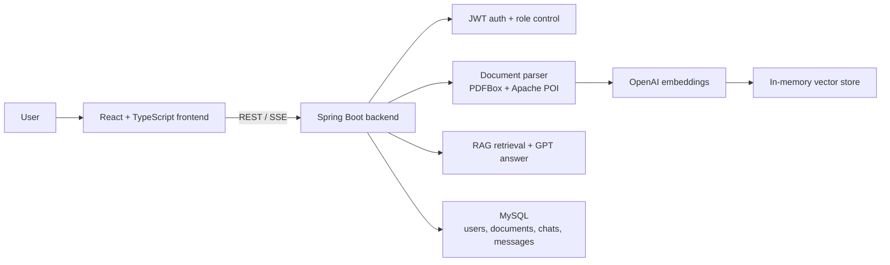

# Housing Rental AI Assistant

A full-stack RAG assistant for rental consultation and document-grounded Q&A. Users can upload rental documents, tenancy policies, house rules, or other knowledge-base files, then ask natural-language questions and receive answers grounded in retrieved document context.

This showcase repository restores the original separate frontend and backend capstone repositories into one GitHub-friendly project structure.

## What It Does

- Upload and manage knowledge-base documents: PDF, TXT, Markdown, HTML, DOC, and DOCX.
- Parse uploaded files, split them into chunks, and create OpenAI embeddings.
- Retrieve the most relevant document segments for each user question.
- Generate answers with GPT based on retrieved context and recent chat history.
- Stream assistant responses through Server-Sent Events.
- Persist users, chat sessions, messages, and document metadata in MySQL.
- Display referenced source documents at the end of AI responses.
- Provide English and Chinese UI text for a bilingual demo experience.

## Architecture



## Tech Stack

| Layer | Main Tools |
| --- | --- |
| Frontend | React 19, TypeScript, Vite, Tailwind CSS, React Router, Axios, React Markdown, i18next |
| Backend | Java 17, Spring Boot 3.3, Spring Security, MyBatis, Flyway |
| AI/RAG | LangChain4j, OpenAI GPT-4o-mini, text-embedding-3-small, in-memory embedding store |
| Data | MySQL 8.x |
| Deployment | Docker Compose, Nginx reverse proxy |

## Repository Layout

```text
.
├── backend/              # Spring Boot RAG API
├── frontend/             # React/Vite web app
├── docs/                 # Original capstone deliverables and showcase notes
├── docker-compose.yml    # Local full-stack deployment
└── .env.example          # Environment template
```

## Quick Start With Docker

Prerequisites: Docker, Docker Compose, and an OpenAI API key.

```bash
cp .env.example .env
# Edit .env and set OPENAI_API_KEY plus strong database/JWT secrets.

cd frontend
npm ci
npm run build

cd ..
docker compose up -d --build
```

Open the app at:

```text
http://localhost:8081
```

Check the backend:

```bash
curl http://localhost:8080/api/health
```

## Local Development

Backend:

```bash
cd backend
mvn spring-boot:run
```

Frontend:

```bash
cd frontend
npm ci
npm run dev
```

The Vite dev server proxies `/api` requests to `http://localhost:8080`.

## Demo Flow

1. Register an admin account.
2. Log in and open `Documents`.
3. Upload a rental policy, tenancy agreement, or house-rules document.
4. Create a chat session.
5. Ask rental-domain questions such as contract termination, deposit rules, repair process, or property policies.
6. Review the streamed answer and referenced source documents.

## Main API Surface

| Area | Endpoint |
| --- | --- |
| Health | `GET /api/health` |
| Auth | `POST /api/auth/register`, `POST /api/auth/login` |
| Documents | `POST /api/docs/upload`, `GET /api/docs`, `GET /api/docs/{id}`, `GET /api/docs/{id}/content`, `DELETE /api/docs/{id}` |
| Chat | `POST /api/chat/create`, `GET /api/chat/list`, `GET /api/chat/{chatId}/history`, `POST /api/chat/{chatId}/send`, `POST /api/chat/{chatId}/stream` |

## Recruiter-Facing Highlights

- Built a practical RAG workflow instead of a prompt-only chatbot: document parsing, embedding, retrieval, answer generation, source references, and persistent conversations.
- Delivered a complete web product: authentication, role-based document management, chat sessions, streaming output, and bilingual UI.
- Used production-oriented engineering choices: JWT auth, Flyway migrations, Docker Compose deployment, Nginx proxying, and environment-based secrets.
- Restored and cleaned the project into a single repository so interviewers can inspect the full architecture without jumping across separate repos.

## Original Project Evidence

- Original backend repository: <https://github.com/M-Downey/5105-Capstone-backend>
- Original frontend repository: <https://github.com/M-Downey/5105-Capstone-frontend>
- Course deliverables are preserved under `docs/`.
- Chinese project and GitHub publishing notes are available in `docs/PROJECT_SHOWCASE_CN.md` and `docs/GITHUB_DEPLOYMENT_CN.md`.

## Notes

- The vector store is in-memory. Uploaded files are re-indexed on backend startup from the configured upload directory.
- Do not commit `.env`; use `.env.example` as the template.
- A live cloud deployment requires a server or container platform. GitHub Pages can host only the static frontend and cannot run the Spring Boot/MySQL/OpenAI backend.
